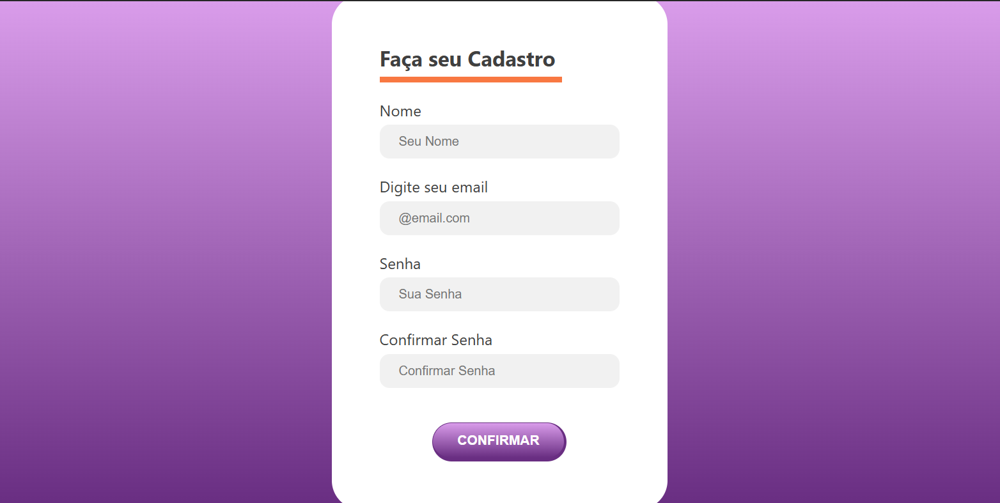

Este projeto é uma página de formulário de cadastro criada para praticar HTML e CSS.

📌 Funcionalidades
- Formulário com campos básicos de cadastro.
- Layout responsivo simples.
- Estruturação semântica usando HTML5.

🚀 Tecnologias utilizadas
- HTML5
- CSS3

> Como visualizar o projeto <
1. Faça o download ou clone este repositório:
   ```bash
   git clone https://github.com/amandhamdo/Form-cadastro.git

📸 Imagem do Projeto



📚 Aprendizados

Estrutura básica de formulários em HTML.

Estilização de inputs e botões com CSS.
